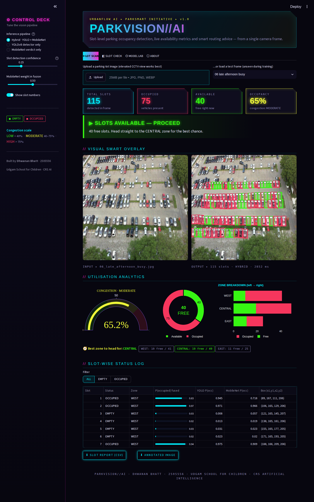
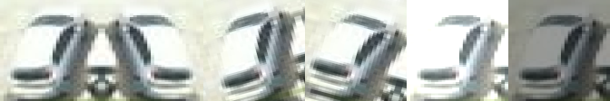
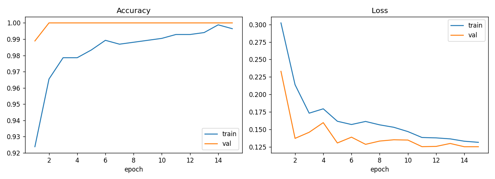
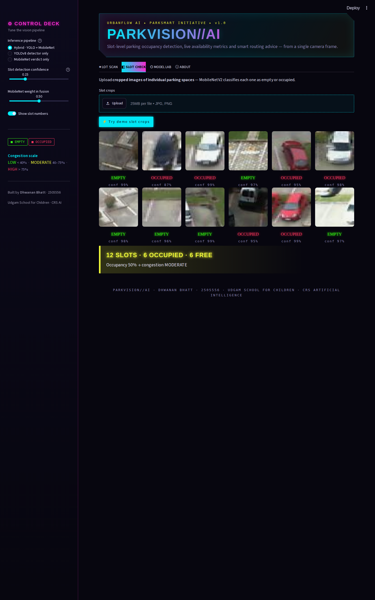
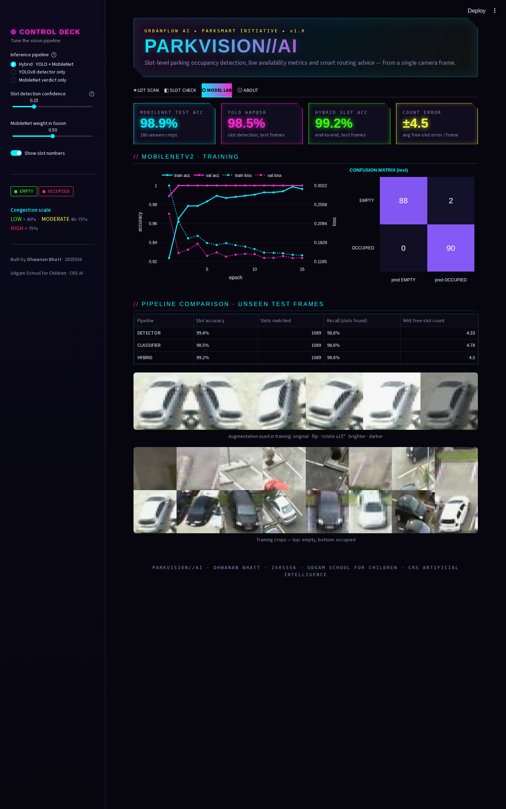

# 🅿️ PARKVISION//AI
### Intelligent Urban Parking Analytics & Space Optimisation Platform

**🔗 Live app: https://parkvision-ai-dhwanan.streamlit.app**

| | |
|---|---|
| **Student** | Dhwanan Bhatt |
| **Student ID** | 2505556 |
| **School** | Udgam School for Children |
| **CRS** | Artificial Intelligence |
| **Course** | Machine Learning and Deep Learning — Summative Assessment |
| **Scenario** | Scenario 1 · ParkVision AI (UrbanFlow AI Pvt. Ltd. — *ParkSmart AI* project) |

ParkVision AI looks at one parking-lot camera frame and tells you, **slot by slot**, which spaces are occupied and which are free. It then turns those predictions into live availability numbers, a congestion level, a per-zone breakdown and a clear *proceed / try another area* recommendation, all inside a neon cyberpunk Streamlit dashboard.



---

## 1 · Problem understanding & requirements

Drivers in busy cities can spend many minutes circling for a space, which adds traffic, burns fuel and causes frustration. A camera already watching the lot can fix this if a model can judge **every individual slot** in real-world conditions.

| Requirement | Definition used in this project |
|---|---|
| **Input** | A parking-lot image (elevated CCTV-style view) |
| **Output** | Slot-wise status (**Occupied / Empty**), plus **total**, **occupied** and **available** slots |
| **Parking structure** | PKLot lots have fixed bays, but the rows are irregular: angled bays, trees and lamp posts, partly visible rows. I therefore used **full-image detection** so no hand-drawn slot map is needed, and **crop classification** as a second opinion. |
| **Approach** | **Hybrid**: YOLOv8n detects and labels every slot → MobileNetV2 re-classifies every slot crop → the two probabilities are fused |
| **Real-world challenges** | Shadows and harsh sun, overcast and rain, occlusion by neighbouring cars and trees, tiny far-away slots |
| **Insights** | Occupancy %, congestion (Low < 40 %, Moderate 40–75 %, High > 75 %), best zone, recommendation |

### Research findings that shaped the design
* **PKLot** (Almeida et al., 2015) showed that texture features plus a classifier on **per-slot crops** generalise across sunny, cloudy and rainy days. This is the basis for my crop-classification branch.
* **Deep CNNs on slot crops** (e.g. Amato et al., *CNRPark+EXT / mAlexNet*, 2017) reach very high accuracy and can run on cheap hardware. That is why I picked the lightweight **MobileNetV2** rather than a heavy network.
* **Detection-based approaches** (YOLO family, and the MDPI *Sensors* 2023 paper on vision-based parking-slot detection) remove the need for manually annotated slot maps and cope with new camera angles. This is the basis for my **YOLOv8n** branch.
* Surveys of smart-parking vision systems recommend **evaluating under changing light and weather** and reporting the *count error*, not just the classifier accuracy. My testing (section 6) follows this advice.

---

## 2 · Data collection & preprocessing

**Dataset:** [PKLot on Kaggle](https://www.kaggle.com/datasets/ammarnassanalhajali/pklot-dataset) (12,416 frames from the UFPR04, UFPR05 and PUCPR lots; sunny, cloudy and rainy days; COCO boxes labelled `space-empty` / `space-occupied`).

Instead of using all the data blindly, I built a **balanced, varied subset** (`src/01_prepare_data.py`):

1. **Frame sampling:** 240 frames were drawn evenly from five occupancy bands (0–20 %, …, 80–100 %) across **75 different days**. 121 of them downloaded cleanly and form the working set.
2. **Frame-level 70 / 15 / 15 split:** 85 train, 18 validation and 18 test frames. Crops from one frame never appear in two splits, which prevents data leakage.
3. **Slot crops for classification:** each labelled slot is cut out with 8 % padding and **resized to 224 × 224**. Degenerate boxes (< 8 px) are removed as label cleaning. The set is balanced to **600 crops per class**:

| split | empty | occupied |
|---|---|---|
| train (70 %) | 420 | 420 |
| val (15 %) | 90 | 90 |
| test (15 %) | 90 | 90 |

4. **Detection set:** the same frames in YOLO format (`class cx cy w h`), 640 × 640. That gives 5,392 train, 936 val and 1,104 test slot boxes.
5. **Folder structure:** `classification/{train,val,test}/{empty,occupied}/`, the layout `torchvision.datasets.ImageFolder` and Keras expect.
6. **Augmentation** (training only): random rotation ± 15°, horizontal and vertical flips, brightness / contrast / saturation jitter (sun, shade and rain) and random resized crops. YOLO additionally uses HSV brightness, mosaic and scale jitter.


*original · flip · +15° · −15° · brighter · darker*

The subset is included in `dataset/` as small zips (so each file fits GitHub's web-upload limit): `cls_{train,val,test}_{empty,occupied}.zip` hold the 224×224 slot crops, and `det_images_part*.zip` + `det_labels_and_yaml.zip` hold the YOLO frames and labels. Unzip them all in one folder to rebuild `classification/` and `detection/`.

---

## 3 · Model development

### 3a · MobileNetV2 slot classifier (`src/02_train_classifier.py`)
| Setting | Value |
|---|---|
| Base | MobileNetV2, ImageNet pre-trained (transfer learning) |
| Frozen | first 10 feature blocks (generic edges and textures) |
| Head | Dropout 0.3 → Linear(1280 → 2) |
| Epochs / batch | **15** / **32** |
| Optimiser | AdamW, lr 1e-3, weight decay 1e-4, cosine schedule |
| Loss | Cross-entropy with label smoothing 0.05 |

| Metric (unseen test crops) | Value |
|---|---|
| **Accuracy** | **98.9 %** (178 / 180) |
| Empty: precision / recall | 1.000 / 0.978 |
| Occupied: precision / recall | 0.978 / 1.000 |

| | pred EMPTY | pred OCCUPIED |
|---|---|---|
| **EMPTY** | 88 | 2 |
| **OCCUPIED** | 0 | 90 |



The only two errors are empty slots predicted as occupied. Every occupied slot was caught.

### 3b · YOLOv8n slot detector (`src/03_train_yolo.py`, `src/03b_finetune_yolo.py`)
COCO-pre-trained YOLOv8n with 2 classes, 640 px input, batch 8, AdamW.

**Model improvement:** round 1 was good, but its **recall was only 0.84**. Missed slots directly corrupt the free-space count. For round 2 I continued from the best round-1 weights with a lower learning rate, less mosaic (closer to real frames) and stronger brightness augmentation:

| Test frames (18 unseen) | Round 1 (25 epochs) | **Round 2 (+20 epochs)** |
|---|---|---|
| mAP@50 | 0.881 | **0.985** |
| mAP@50-95 | 0.538 | **0.648** |
| Precision | 0.908 | **0.966** |
| Recall | 0.842 | **0.952** |

Round 2 is the model that ships in the app. YOLO curves and confusion matrix are in `reports/yolo/`.

### 3c · Deployment format
Both models are exported to **ONNX** and run with `onnxruntime`. The app does not need PyTorch at all, so it starts quickly and fits within Streamlit Cloud's free-tier memory. The ONNX weights are stored as external data split into `*.partN.bin` files of under 3.5 MB each. This is lossless, and `onnxruntime` loads them automatically.

---

## 4 · Integration & parking insight logic (`parkvision/engine.py`)

1. **Detect:** YOLO returns every slot with P(occupied).
2. **Verify:** each slot is cropped and MobileNetV2 gives a second P(occupied).
3. **Fuse:** `P = (1 − w)·P_yolo + w·P_mobilenet` (w = 0.5 by default, adjustable in the sidebar). Occupied if P ≥ 0.5.
4. **Count:** total, occupied and available slots.
5. **Utilisation:** occupancy % = occupied / total.
6. **Congestion level:** **LOW** < 40 % · **MODERATE** 40–75 % · **HIGH** > 75 %.
7. **Zones:** the lot is split into WEST, CENTRAL and EAST thirds, and free spaces are counted in each to find the **best zone**.
8. **Recommendation:**

| Situation | Message |
|---|---|
| 0 free | **PARKING FULL — TRY ANOTHER AREA** |
| High (> 75 %) | **NEARLY FULL — TRY ANOTHER AREA** (+ where the last spaces are) |
| Moderate | **SLOTS AVAILABLE — PROCEED** (+ best zone) |
| Low | **PLENTY OF SPACE — PROCEED** (+ best zone) |

---

## 5 · Web app (Streamlit)

`app.py` has a custom neon cyberpunk theme (Orbitron, Rajdhani and Share Tech Mono fonts, glowing clipped-corner cards and a scan-line overlay).

| Tab | What it does |
|---|---|
| **◉ LOT SCAN** | Upload an image or pick one of 8 unseen test frames. Shows the input and the annotated output (**green = empty, red = occupied**, numbered slots), KPI cards (total / occupied / available / occupancy), the recommendation banner, a congestion gauge, a free vs occupied donut, the zone breakdown, a filterable slot-wise table, and CSV / PNG downloads. |
| **◧ SLOT CHECK** | Upload single-slot crops and MobileNetV2 classifies each one, with confidence. |
| **⌬ MODEL LAB** | Test metrics, training curves, confusion matrix, pipeline comparison and augmentation examples. |
| **ⓘ ABOUT** | Problem, method, data and known limits. |

Sidebar controls: pipeline (Hybrid / YOLO only / MobileNet only), detection confidence, fusion weight and slot-number toggle.




---

## 6 · Testing & feedback (`src/04_evaluate_pipeline.py`)

The **complete app pipeline** was run on the 18 held-out test frames (1,104 labelled slots) that were never used in training. A prediction counts when it overlaps a labelled slot with IoU ≥ 0.5.

| Pipeline | Slot accuracy | Slots found (recall) | Avg. free-slot count error / frame |
|---|---|---|---|
| YOLO only | **99.4 %** | 98.6 % | 4.3 |
| MobileNet only (on YOLO boxes) | 98.5 % | 98.6 % | 4.8 |
| **Hybrid (default)** | 99.2 % | 98.6 % | 4.5 |

**Robustness under different lighting and weather** (the test frames were artificially degraded):

| Condition | YOLO only | **Hybrid** | Recall |
|---|---|---|---|
| Dark (−45 % brightness) | 99.7 % | 99.5 % | 98.6 % |
| Bright / glare (+60) | 99.5 % | **99.8 %** | 97.3 % |
| Low contrast (haze / rain) | 96.8 % | **98.8 %** | 97.5 % |
| Motion blur | 97.5 % | 96.3 % | **36.8 %** ⚠️ |

**What this showed, and what I changed:**
* On clean frames YOLO alone is marginally best. In **glare and haze the hybrid is clearly more reliable** (+2 points in low contrast), so Hybrid is the default and the fusion weight is exposed in the sidebar.
* The count error of about 4 free slots per frame is mostly caused by **real slots outside PKLot's labelled region** (PKLot only labels part of each lot), not by wrong labels.
* **Motion blur** hardly hurts classification, but YOLO then misses most slots. This is a limitation: the camera must be steady. The fix would be to retrain with blur augmentation.
* Improvements made from my own test runs: slot numbers were hard to read on dense lots, so I added a **"Show slot numbers" toggle**. Knowing *whether* to park is not enough without knowing *where*, so I added the **zone breakdown and best-zone advice**.
* **User feedback:** _(add notes from classmates or family who tried the live app here)_.
* **Known limit:** the models were trained on elevated fixed-camera views. Street-level photos, night scenes and heavy occlusion are expected to reduce accuracy.

---

## 7 · Deployment

* Code, models, requirements and dataset are in this repository.
* Deployed on **Streamlit Community Cloud**: **https://parkvision-ai-dhwanan.streamlit.app**

Run locally:
```bash
pip install -r requirements.txt
streamlit run app.py
```
Retrain everything (CPU is fine; about 1 h in total):
```bash
pip install torch torchvision ultralytics scikit-learn matplotlib onnx
python src/01_prepare_data.py          # needs PKLot frames in data/raw + _annotations.coco.json
python src/02_train_classifier.py 15
python src/03_train_yolo.py 25 && python src/03b_finetune_yolo.py
python src/04_evaluate_pipeline.py
```

## Repository structure
```
app.py                        Streamlit dashboard
parkvision/engine.py          inference + insight logic (ONNX Runtime)
models/                       slot_classifier.onnx + yolo_slots.onnx (weights in *.partN.bin)
src/                          data prep, training, improvement round, evaluation, notebook builder
ParkVision_AI_Notebook.ipynb  end-to-end walkthrough with outputs
dataset/                      preprocessed PKLot subset (classification crops + YOLO frames)
reports/                      metrics JSON, curves, confusion matrices, YOLO plots
samples/                      unseen test frames + demo slot crops used by the app
docs/screenshots/             app screenshots
```

## References
1. Almeida, P., Oliveira, L. S., Silva Jr, E., Britto Jr, A., Koerich, A. (2015). *PKLot – A robust dataset for parking lot classification.* Expert Systems with Applications, 42(11), 4937–4949.
2. Amato, G., Carrara, F., Falchi, F., Gennaro, C., Meghini, C., Vairo, C. (2017). *Deep learning for decentralized parking lot occupancy detection.* Expert Systems with Applications, 72, 327–334.
3. Sandler, M., Howard, A., Zhu, M., Zhmoginov, A., Chen, L.-C. (2018). *MobileNetV2: Inverted Residuals and Linear Bottlenecks.* CVPR.
4. Jocher, G., Chaurasia, A., Qiu, J. (2023). *Ultralytics YOLOv8.* https://docs.ultralytics.com
5. *Vision-Based Parking Slot Detection using Deep Learning.* Sensors 2023, 23(15), 6869. https://www.mdpi.com/1424-8220/23/15/6869
6. *Deep Learning Based Smart Parking Occupancy Detection using Computer Vision.* PMC12568149. https://pmc.ncbi.nlm.nih.gov/articles/PMC12568149/
7. Streamlit documentation: https://docs.streamlit.io · OpenCV: https://opencv.org · ONNX Runtime: https://onnxruntime.ai

*Dataset licence: PKLot, CC BY 4.0. Please cite Almeida et al. (2015).*
